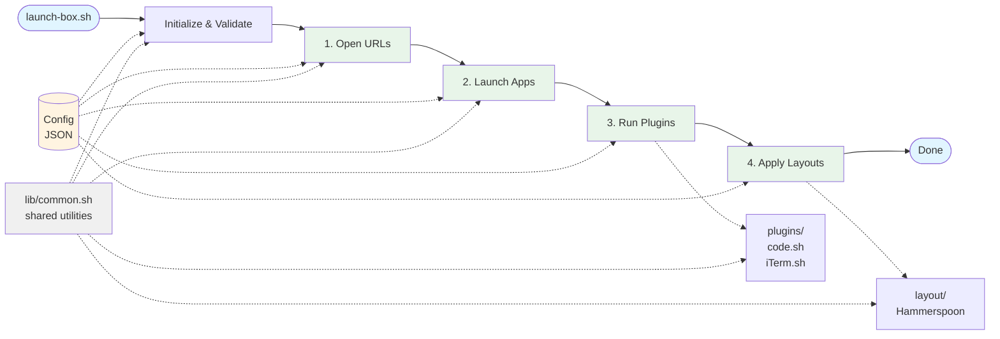

# launch‑box

Open your daily tabs and apps on macOS with one command, powered by a simple config file.

Every morning, you probably open the same browser tabs, launch the same apps, configure them, and arrange windows the same way. This tool reads your config and does it all for you. What started as a small time saver for my morning routine ended up being something I use every day. So I kept refining it.


---

## Setup
```bash
git clone https://github.com/lukecassidy/launch-box.git
cd launch-box
chmod +x launch-box.sh

# Install dependencies
brew install jq hammerspoon figlet
```

---

## Config
The default config file is `launch-config.json` in the project root with four sections: `urls`, `apps`, `plugins`, and `layouts`.

`launch-config.json`:
```json
{
  "urls": [
    "https://calendar.google.com/calendar/u/0/r/week",
    "https://mail.google.com/mail/u/0/#inbox",
    "https://github.com/notifications"
  ],
  "apps": [
    "Visual Studio Code",
    "Slack",
    "iTerm"
  ],
  "plugins": {
    "code": {},
    "iTerm": {
      "panes": [
        "clear; figlet luke",
        "clear; figlet is",
        "clear; figlet cool"
      ]
    }
  },
  "layouts": {
    "single": {
      "Built-in Retina Display": [
        { "slot": "lft_half_all", "app": "code" },
        { "slot": "rgt_half_all", "app": "Slack" }
      ]
    }
  }
}
```

Sections:
- **urls**: Any valid `http`/`https` links. Opened in your default browser.
- **apps**: Must match names in `/Applications` (e.g. `Visual Studio Code`, `Google Chrome`, `Slack`).
- **plugins**: Each entry corresponds to a script in `plugins/` for post launch app configuration (e.g. VS Code window merging, iTerm pane setup).
- **layouts**: Hammerspoon window layout configurations for different screen setups.

---

## Usage
Flags
- `-c, --config <file>`  Use a custom config
- `-d, --dry-run`        Print actions only
- `-h, --help`           Show usage

Examples:
```bash
./launch-box.sh                   # Use the default config (launch-config.json)
./launch-box.sh -c work.json      # Use a custom config file
./launch-box.sh -d                # Dry run
```

---

## Installation

You can run LaunchBox as a macOS app, run the shell script directly, or setup a menu bar shortcut. The app approach is recommended for easy permission management.

### Option 1: Install as macOS App (Recommended)

This gives LaunchBox its own identity for system permissions:

```bash
./install-app.sh         # Normal installation (copies files)
./install-app.sh --dev   # Dev mode (symlinks files)
```

Installs **LaunchBox.app** to `/Applications` with its own system permissions.

**Dev mode:** Use `--dev` to symlink scripts instead of copying them. Changes to source files will be immediately reflected when running the app.

### Option 2: Run via Shell Script

You can also run `launch-box.sh` directly from Terminal:

```bash
./launch-box.sh                   # Use the default config
./launch-box.sh -c work.json      # Use a custom config file
./launch-box.sh -d                # Dry run
```

### Option 3: Automator + Shortcuts

1. Open Applications → Automator → New Document → Application
2. Add "Run Shell Script" action
3. Paste: `"/Path/to/launch-box/launch-box.sh" "$@"`
4. Save as `Launch Box`
5. Open Shortcuts → New Shortcut → Open App → Select `Launch Box`
6. Click "i" icon & turn on 'Pin in Menu Bar'

---

## Troubleshooting
If you encounter permission issues, grant **Accessibility** permissions to the app that runs `launch-box.sh`. Depending on your setup, this could be iTerm2, Shortcuts, Automator etc. You can do this via:
- System Settings → Privacy & Security → Accessibility

After granting access, try running the script again.

---

## Architecture



**4-Phase Execution:**
1. **Open URLs** - Browser tabs from config
2. **Launch Apps** - macOS applications
3. **Run Plugins** - Extensible app-specific configuration
4. **Apply Layouts** - Window positioning via Hammerspoon

**Key Components:**
- **launch-box.sh**: Main orchestrator
- **Config JSON**: Single file drives all behavior (urls, apps, plugins, layouts)
- **lib/common.sh**: Shared utilities (logging, validation, process management)
- **plugins/**: Extensible system (code.sh for VS Code, iTerm.sh for terminal panes)
- **layout/**: Hammerspoon integration for window management

---

## Uninstallation

To remove LaunchBox.app:

```bash
./uninstall-app.sh
```

This removes the app from `/Applications` and optionally removes your config at `~/.launch-box/`.

---

## TODO
- [ ] Add more elegant screen name handling
- [ ] Support multiple Chrome profiles (e.g., work vs personal)
- [ ] More plugins
  - [ ] Finder - Open recent files
  - [ ] Spotify - play playlists
  - [ ] Slack - Navigate to channel, set status
- [ ] Add multi config support for app install option
- [ ] Dry-run mode for plugins